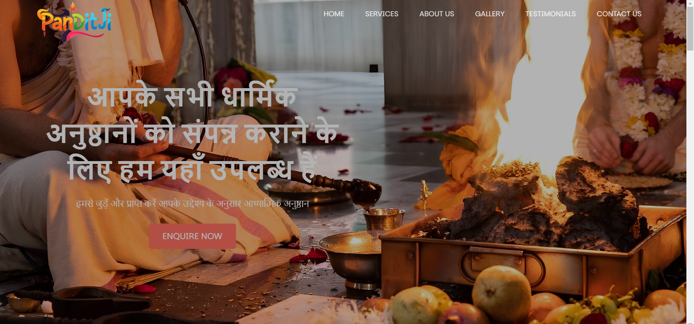
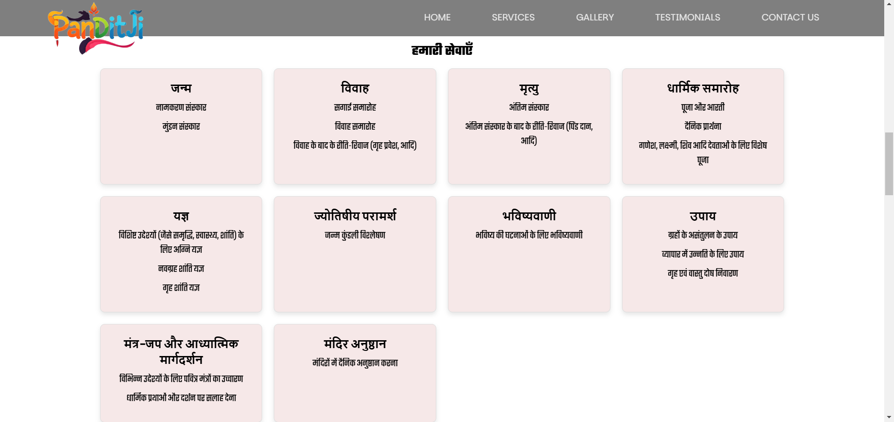
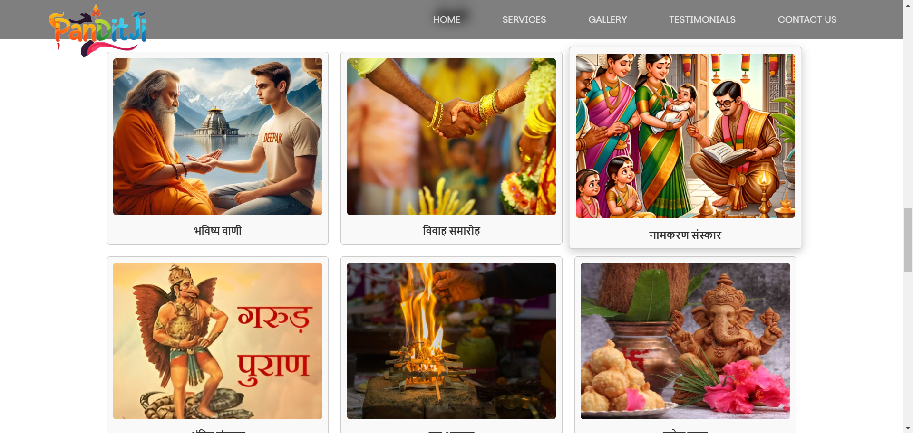
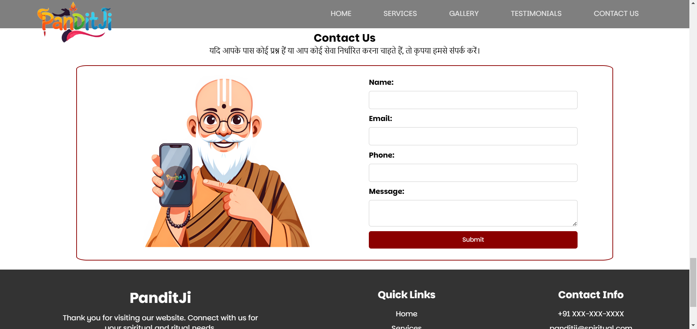

# PanditJi - Spiritual & Ritual Services

Welcome to **PanditJi**, your trusted spiritual and ritual services provider. We specialize in conducting various religious ceremonies, consultations, and services according to your needs. This website provides an easy way to learn about our services, view our gallery, read client testimonials, and contact us for more information.

---

## Table of Contents

1. [Introduction](#introduction)
2. [Features](#features)
3. [Technologies Used](#technologies-used)
4. [Screenshots](#screenshots)
5. [Installation](#installation)
6. [Usage](#usage)
7. [Contact](#contact)

---

## Introduction

**PanditJi** offers a variety of religious services, including but not limited to:

- **Religious Ceremonies**: Weddings, Birth Ceremonies, Funerals
- **Astrology and Predictions**
- **Spiritual Guidance**
- **Yagya and Pooja** (Fire rituals for peace and prosperity)
- **Vastu Shastra Consultation**
- **Astrological Consultations** (Horoscope readings, Kundli matching)

Our services are offered with dedication and the highest respect for tradition. For a peaceful and prosperous life, join us for your spiritual needs.

---

## Features

- **Responsive Design**: Optimized for both desktop and mobile views.
- **Service Categories**: Detailed list of all services provided, including Birth, Marriage, Funeral, and more.
- **Gallery**: Photos from past events and ceremonies.
- **Testimonials**: Hear from our satisfied clients.
- **Contact Form**: Get in touch with us easily for more inquiries.

---

## Technologies Used

This website is built using the following technologies:

- **HTML5**: Structure and content.
- **CSS3**: Styling, layout, and animations.
- **JavaScript**: Interactive elements such as the mobile menu and form handling.
- **Google Fonts**: To use beautiful, readable typography.

---

## Screenshots

Here are some snapshots of the **PanditJi** website:

### Homepage


### Services Section


### Gallery Section


### Contact Us Section


### Testimonials Section


---

## Installation

To run the PanditJi website locally, follow these steps:

1. Clone the repository to your local machine:
   ```bash
   git clone https://github.com/your-username/panditji-website.git

2. Navigate to the project directory:
   ```bash
   cd panditji-website

3. Open the index.html file in your browser:
   ```bash
     open index.html  # macOS
   start index.html # Windows
   xdg-open index.html # Linux

## Usage
After installation, you can view the website locally. The main sections are:

- **Home:** Introduction to the PanditJi website and its offerings.
- **Services:** A list of all spiritual and ritual services provided.
- **Gallery:** View photos from various ceremonies.
- **Testimonials:** Read what our clients say about their experiences.
- **Contact:** Fill out the form to inquire about services or schedule an appointment.

For any additional customization, you can modify the HTML, CSS, and JavaScript files.

## Contact
For more information, or to book a service, please get in touch with us using the contact form on the website.

## License
This project is licensed under the MIT License - see the LICENSE file for details.

## Contributing
We welcome contributions to improve this website. If you'd like to contribute, please fork the repository, create a new branch, and submit a pull request.

## Thank You
Thank you for visiting PanditJi. We hope you find peace and blessings through our services.


